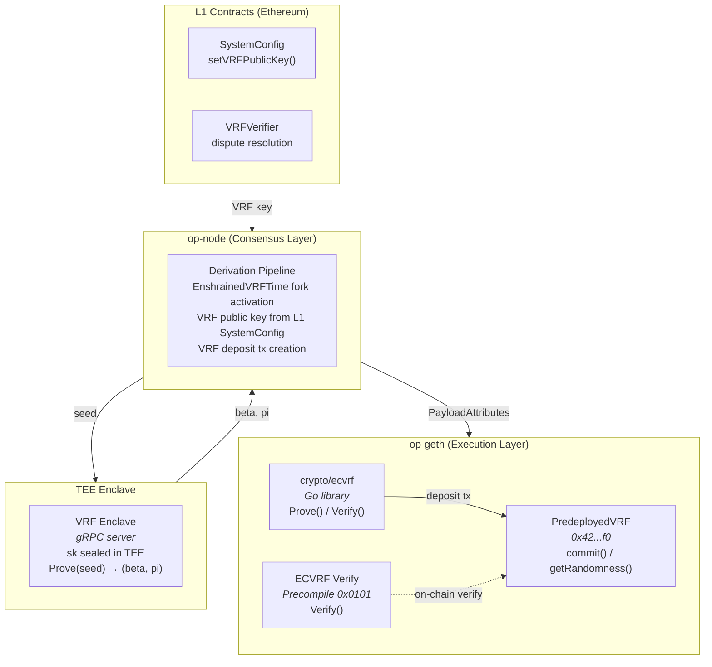

# Enshrined VRF

**Protocol-native verifiable randomness for the OP Stack.**

Enshrined VRF embeds an [ECVRF](https://datatracker.ietf.org/doc/html/rfc9381) precompile directly into the OP Stack L2, allowing smart contracts to receive **verifiable, unbiasable randomness in a single transaction** — no oracle, no callback, no extra fee.

```solidity
contract CoinFlip {
    IEnshrainedVRF constant VRF = IEnshrainedVRF(0x42000000000000000000000000000000000000f0);

    function flip() external returns (bool) {
        return (VRF.getRandomness() % 2 == 0);
    }
}
```

## Why

| | Enshrined VRF | External Oracle VRF |
|---|---|---|
| Latency | Same transaction | 2+ transactions (request → callback) |
| Cost | ~24K gas | ~200K+ gas + LINK/subscription |
| Trust | Protocol-level, fault-provable | Oracle network trust assumption |
| Bias resistance | TEE-protected secret key | Oracle-dependent |

## How It Works

```
op-node ────────────────────────────▶ op-geth (sequencer)
                                          │
                                          ├─ seed = sha256(blockNumber)
                                          ├─ (beta, pi) = TEE.Prove(seed)  ← sk never leaves enclave
                                          └─ deposit tx → PredeployedVRF.commitRandomness()
                                                              │
                                                              ▼
                                                    User calls getRandomness()
                                                    → returns beta (verifiable output)
```

1. **Sequencer** sends seed to the **TEE enclave**, which computes `ECVRF.Prove(sk, seed)` — the secret key never leaves the enclave
2. **Result** is committed via a system deposit transaction to `PredeployedVRF`
3. **Contracts** call `getRandomness()` to consume committed randomness synchronously
4. **Anyone** can verify proofs on-chain using the ECVRF verify precompile at `0x0101`
5. **Fault proofs** detect invalid VRF outputs — the sequencer cannot cheat

## Architecture



## Components

| Component | Location | Description |
|-----------|----------|-------------|
| **ECVRF Library** | `crypto/ecvrf/` | ECVRF-SECP256K1-SHA256-TAI (RFC 9381), constant-time ModNScalar |
| **Verify Precompile** | `core/vm/` | EVM precompile at `0x0101`, 3,000 gas |
| **PredeployedVRF** | `contracts/src/` | L2 predeploy at `0x42...f0`, dual-nonce design |
| **VRFVerifier** | `contracts/src/L1/` | L1 dispute resolution (proof-to-hash, seed verification) |
| **TEE Enclave** | `vrf-enclave/` | gRPC server holding sk in TEE, key sealing, attestation |
| **Block Builder** | `op-geth/miner/` | Sequencer VRF prove + deposit tx injection |
| **Derivation** | `optimism/op-node/` | Fork config, payload attributes, event parsing |
| **SystemConfig** | `optimism/.../L1/` | VRF public key management on L1 |

## Specifications

| Parameter | Value |
|-----------|-------|
| Algorithm | ECVRF-SECP256K1-SHA256-TAI (RFC 9381) |
| Suite string | `0xFE` (custom) |
| Proof size | 81 bytes (33 point + 16 challenge + 32 scalar) |
| Output size | 32 bytes |
| Precompile address | `0x0101` |
| Predeploy address | `0x42000000000000000000000000000000000000f0` |
| Verify gas | 3,000 |
| Prove latency | ~0.35ms |
| Verify latency | ~0.42ms |
| Fork name | `EnshrainedVRF` |

## Security

- **TEE-protected secret key**: The VRF private key lives exclusively inside the TEE enclave — the sequencer operator cannot access it, ensuring unpredictability
- **Seed simplicity**: `seed = sha256(blockNumber)` — the seed is deterministic and publicly known. Security relies entirely on TEE key isolation, not seed entropy
- **Tamper detection**: 100% bit-flip rejection rate across all 648 proof bits
- **Constant-time arithmetic**: All secret scalar operations use `ModNScalar` to prevent timing side channels
- **Fault provable**: Invalid VRF outputs cause state root divergence, detectable by Cannon/Asterisc

## Testing

```
82 tests | 164K+ fuzz iterations | 0 crashes | 100% bit-flip rejection
```

| Suite | Tests | Coverage |
|-------|-------|----------|
| ECVRF Go library | 22 + 2 fuzz | Prove/Verify round-trip, determinism, tampering, distribution |
| Verify precompile | 9 | All input variants, gas calibration |
| PredeployedVRF | 31 | Access control, nonce, events, batch, integration |
| VRFVerifier | 20 + fuzz | Proof-to-hash, seed, nonce sequence, known vectors |

```bash
# Run Go tests
go test ./crypto/ecvrf/ -v
go test ./core/vm/ -v

# Run Solidity tests
cd contracts && forge test -v

# Run fuzz (30 seconds)
go test ./crypto/ecvrf/ -fuzz=FuzzProveVerify -fuzztime=30s
```

## Fork Diff

View the exact changes against upstream OP Stack:

```bash
cd diff-site && bash generate.sh && open out/index.html
```

Generated with [protolambda/forkdiff](https://github.com/protolambda/forkdiff), showing structured diffs for both [op-geth](https://github.com/ethereum-optimism/op-geth) and [optimism](https://github.com/ethereum-optimism/optimism).

## Repository Structure

```
enshrined-vrf/
├── crypto/ecvrf/              # ECVRF Go library (standalone)
├── core/vm/                   # Verify precompile (standalone)
├── contracts/                 # Solidity contracts + Foundry tests
│   ├── src/
│   │   ├── PredeployedVRF.sol          # L2 predeploy
│   │   ├── interfaces/IEnshrainedVRF.sol
│   │   └── L1/VRFVerifier.sol          # L1 dispute resolution
│   └── test/
├── vrf-enclave/               # TEE enclave gRPC server
│   ├── enclave/                        # Server, key sealing, attestation
│   ├── proto/                          # Protobuf definitions
│   └── cmd/vrf-enclave/                # Entrypoint
├── op-geth/                   # Forked op-geth (submodule)
├── optimism/                  # Forked optimism (submodule)
├── diff-site/                 # forkdiff viewer
├── e2e/                       # E2E test scaffolding
└── docs/
    ├── PRD.md
    ├── architecture.md
    ├── security-audit-checklist.md
    └── phase-{1,2,3,4}-report.md
```

## Building

```bash
# Clone with submodules
git clone --recursive https://github.com/tokamak-network/enshrined-vrf.git

# Build ECVRF library
go build ./crypto/ecvrf/

# Build Solidity contracts
cd contracts && forge build

# Run all tests
go test ./crypto/ecvrf/ ./core/vm/
cd contracts && forge test
```

## Local Testing Guide

### Prerequisites

```bash
go version    # Go 1.24+
forge --version  # Foundry
```

### Step 1: Unit Tests

```bash
# ECVRF Go library (22 tests)
go test ./crypto/ecvrf/ -v

# Verify precompile (9 tests)
go test ./core/vm/ -v

# Solidity contracts (51 tests)
cd contracts && forge test -v

# Fuzz tests (30 seconds each)
go test ./crypto/ecvrf/ -fuzz=FuzzProveVerify -fuzztime=30s
go test ./crypto/ecvrf/ -fuzz=FuzzVerifyRejectsRandom -fuzztime=30s
```

### Step 2: TEE Enclave Server

```bash
# Build and run the enclave server (dev mode)
cd vrf-enclave
go run ./cmd/vrf-enclave/ --listen localhost:50051 --seal-dir ./sealed

# In another terminal, test with grpcurl
grpcurl -plaintext localhost:50051 vrf.VRFEnclave/GetPublicKey
```

### Step 3: TEE Integration Tests

```bash
# Tests the full op-node → TEE enclave → verify path
cd optimism/op-node/rollup/derive
go test -run TestTEEVRFProver -v
```

### Step 4: Devnet E2E (Full Stack)

```bash
# 1. Configure fork activation (genesis부터 활성화)
# rollup config에 추가: "enshrined_vrf_time": 0
# op-geth chain config에 추가: "enshrainedVRFTime": 0

# 2. Set VRF private key for sequencer
export VRF_PRIVATE_KEY=c9afa9d845ba75166b5c215767b1d6934e50c3db36e89b127b8a622b120f6721

# 3. Start devnet
cd optimism && make devnet-up

# 4. Verify VRF is working
cast code 0x42000000000000000000000000000000000000f0 --rpc-url http://localhost:8545
cast call 0x42000000000000000000000000000000000000f0 "commitNonce()(uint256)" --rpc-url http://localhost:8545
cast call 0x42000000000000000000000000000000000000f0 "sequencerPublicKey()(bytes)" --rpc-url http://localhost:8545
```

### Step 5: Demo — CoinFlip

```bash
# Deploy CoinFlip example contract
cd contracts
forge create src/examples/CoinFlip.sol:CoinFlip \
  --rpc-url http://localhost:8545 \
  --private-key <TEST_PRIVATE_KEY>

# Flip a coin (calls getRandomness() internally)
cast send <COINFLIP_ADDR> "flip()(bool)" \
  --rpc-url http://localhost:8545 \
  --private-key <TEST_PRIVATE_KEY>

# Check the event log for the result
cast logs --from-block latest --address <COINFLIP_ADDR> --rpc-url http://localhost:8545
```

See [docs/testing-guide.md](docs/testing-guide.md) for the full testing guide including troubleshooting.

## License

MIT
