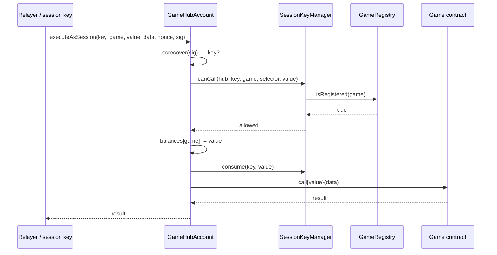

The execution client is a modified `op-geth`. This page walks through the two modifications that matter: **committing randomness per block** and **serving session-account transactions without extra protocol privilege**.

## Per-block VRF commitment

Every block, before it finalizes, the sequencer embeds one ECVRF proof into a deposit-style transaction and pushes it to the top of the block.

<Steps>
  <Step title="Derive the seed">
    `seed = sha256(block.number || nonce)` — deterministic, visible to all validators.
  </Step>
  <Step title="Compute the proof inside the enclave">
    The TEE enclave holding the VRF secret key returns `(beta, pi) = ECVRF.Prove(sk, seed)`.
    `op-geth` never sees `sk`; it only receives the proof.
  </Step>
  <Step title="Emit a commit deposit tx">
    The block builder prepends a synthetic deposit transaction from `DEPOSITOR_ACCOUNT` calling:

    ```solidity
    EnshrainedVRF.commitRandomness(nonce, seed, beta, pi)
    ```

    This stores the proof on-chain and increments `commitNonce`. Because it is a deposit transaction, it cannot be reordered by an attacker or skipped by the sequencer.
  </Step>
  <Step title="Reset the call counter">
    `callCounter` is zeroed at commit time. Game calls to `getRandomness()` within the block each increment it, ensuring per-call uniqueness.
  </Step>
</Steps>

<Note>
  If a block has no game activity, the commit still happens. Determinism across replays matters more than saving a cheap `SSTORE`.
</Note>

## Serving `getRandomness()`

```solidity
function getRandomness() external returns (uint256) {
    callCounter += 1;
    return uint256(keccak256(abi.encode(beta, callCounter)));
}
```

No enclave round-trip. The sequencer already committed this block's `beta`. Every game consuming randomness in the same block shares that commit, with the counter guaranteeing uniqueness. Gas is on the order of two `SLOAD`s plus a hash.

<Warning>
  `callCounter` and `beta` live in predeploy storage. A buggy game cannot clobber them because the predeploy only exposes increments through `getRandomness` and commit-time writes through `commitRandomness` (callable only by `DEPOSITOR_ACCOUNT`).
</Warning>

## Session-account execution

Unlike VRF, the session-account predeploys require **zero protocol privilege**. Every piece of enforcement lives in ordinary EVM state:



Everything above runs entirely inside the EVM. There is no sequencer hook, no special transaction type, no privileged message sender. This means **session accounts work identically on any OP-Stack fork** as long as the four predeploys exist — a property that matters for the eventual `op-geth → op-reth` migration and for downstream L3s.

## State layout

<AccordionGroup>
  <Accordion title="EnshrainedVRF (0x42…F0)">
    - `commitNonce` — monotonically increasing block commit counter.
    - `callCounter` — resets at commit, increments on each `getRandomness`.
    - `lastBeta`, `lastSeed`, `lastPi` — current block's commit, overwritten each commit.
    - `sequencerPublicKey` — set by L1 SystemConfig; used during disputes.
  </Accordion>
  <Accordion title="GameHubFactory (0x42…A0)">
    Stateless apart from immutable predeploy addresses (`SessionKeyManager`, `GameRegistry`).
  </Accordion>
  <Accordion title="SessionKeyManager (0x42…A1)">
    - `_scopes[hub][key]` → `Scope` struct (gameAddr, cap, expiry, selectors).
    - `_active[hub][key]` → `bool`.
  </Accordion>
  <Accordion title="GameRegistry (0x42…A2)">
    - `_registered[game]` → `bool`.
    - `_owner[game]` → `address` (tx.origin at register time).
  </Accordion>
  <Accordion title="Per-user GameHubAccount">
    - `owner`, `factory`, `sessionKeys`, `registry` — immutables.
    - `balances[game]` → `uint256`.
    - `sessionNonce[key]` → `uint256`.
  </Accordion>
</AccordionGroup>

## Upgrade path

Predeploys upgrade via hardfork:

1. A spec change bumps the contract bytecode at a named fork block.
2. `op-geth` and `op-node` release tagged versions encoding the fork.
3. The new bytecode is applied to the predeploy address at the fork boundary; storage layout is preserved unless the spec explicitly defines a migration.

There is no proxy, no upgradeability admin. The chain itself is the upgrade authority.

## Related

<CardGroup cols={2}>
  <Card title="Sequencer & TEE" href="/architecture/sequencer" icon="lock">
    Where the VRF proof comes from and why the operator can't forge it.
  </Card>
  <Card title="Fault proof" href="/architecture/fault-proof" icon="gavel">
    What happens on L1 if the sequencer publishes a bogus commitment.
  </Card>
</CardGroup>
