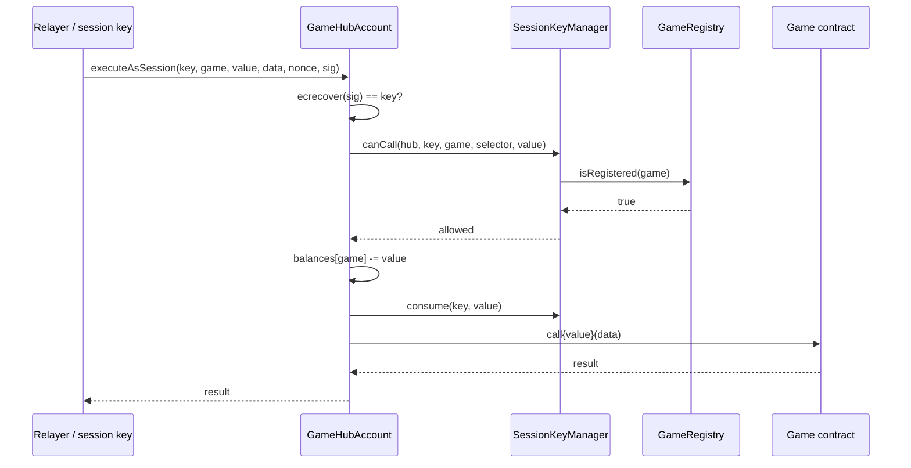

The randomness protocol crosses both OP Stack components:

- `op-node` prepares the VRF proof material while building `PayloadAttributes`.
- `op-geth` validates those attributes and injects deposit transactions into the payload.

Session accounts are different: they require no sequencer hook and execute as ordinary EVM calls.

## Per-block VRF commitment

Every Enshrined VRF block contains a `commitRandomness` system deposit before user transactions.

<Steps>
  <Step title="Read the public key">
    `op-node` carries the 33-byte `vrfPublicKey` from L1 `SystemConfig` into `PayloadAttributes`. `op-geth` mirrors that key into the L2 predeploy by inserting:

    ```solidity
    EnshrainedVRF.setSequencerPublicKey(pk)
    ```
  </Step>
  <Step title="Derive the seed">
    `op-node` computes:

    ```text
    seed = sha256(uint256(blockNumber) || uint256(nonce))
    ```

    The 32-byte big-endian encoding matches `abi.encodePacked(uint256,uint256)`, making the seed reproducible in tests, derivation, and dispute helpers.
  </Step>
  <Step title="Compute the proof through VRFProver">
    `op-node` calls `VRFProver.Prove(seed)` and receives `(beta, pi)`. In production the prover is TEE-backed; in development it can be a local key. `op-geth` never receives the secret key.
  </Step>
  <Step title="Pass proof material through Engine API">
    The payload attributes include `VRFPublicKey`, `VRFSeed`, `VRFProofBeta`, `VRFProofPi`, and `VRFNonce`. If the proof fields are missing or malformed after the fork is active, `op-geth` refuses to build the payload.
  </Step>
  <Step title="Insert the commit deposit">
    `op-geth` prepends a synthetic deposit transaction from `DEPOSITOR_ACCOUNT` calling:

    ```solidity
    EnshrainedVRF.commitRandomness(nonce, seed, beta, pi)
    ```

    The predeploy stores `(seed, beta, pi)` at its internal `commitNonce`, records the current block number, resets `callCounter`, and increments `commitNonce`.
  </Step>
  <Step title="Carry the same data to verifiers">
    When the batcher encodes the block, derivation extracts the VRF commit deposit and stores seed, beta, pi, nonce, and an enabled flag in the batch. Verifier nodes use that batch data to reconstruct the same payload attributes without a prover.
  </Step>
</Steps>

<Note>
  If proof generation fails after retries, `op-node` fails attribute construction. The chain should not build a post-fork block that cannot commit randomness.
</Note>

## Serving `getRandomness()`

```solidity
function getRandomness() external returns (uint256) {
    if (_currentBlock != block.number) revert NoRandomnessAvailable();
    randomness = uint256(keccak256(abi.encodePacked(_currentBeta, _callCounter)));
    unchecked {
        _callCounter++;
    }
}
```

No prover round-trip happens during a game call. The sequencer already committed this block's `beta`. Every game consuming randomness in the same block shares that commitment, with `callCounter` giving each call a distinct derived value.

<Warning>
  `callCounter` and `beta` live in predeploy storage. A buggy game cannot clobber them because the predeploy only exposes increments through `getRandomness` and commit-time writes through `commitRandomness` (callable only by `DEPOSITOR_ACCOUNT`).
</Warning>

## Payload attribute fields

| Field | Set by | Used by |
| ----- | ------ | ------- |
| `VRFPublicKey` | `op-node` from `SystemConfig` | `op-geth` public-key sync deposit |
| `VRFSeed` | `op-node` from block number and nonce | `commitRandomness` calldata and derivation replay |
| `VRFProofBeta` | `VRFProver` | `EnshrainedVRF.currentBeta` and game randomness derivation |
| `VRFProofPi` | `VRFProver` | Historical proof data and dispute checks |
| `VRFNonce` | `op-node` monotonic counter | Seed domain separation and commit calldata |

The payload ID includes VRF attributes, so two otherwise identical payloads with different randomness material do not collide.

## Session-account execution

Unlike VRF, session-account execution requires no sequencer hook. Every piece of enforcement lives in ordinary EVM state:



Everything above runs entirely inside the EVM. There is no sequencer hook, no special transaction type, no privileged message sender. In the current demo, these contracts are deployed normally by `DeploySessionAccounts.s.sol`. The protocol docs reserve fixed `0x4200…` addresses for a later enshrined deployment.

## State layout

<AccordionGroup>
  <Accordion title="EnshrainedVRF (0x42…F0)">
    - `commitNonce` — monotonically increasing block commit counter.
    - `callCounter` — resets at commit, increments on each `getRandomness`.
    - `lastBeta`, `lastSeed`, `lastPi` — current block's commit, overwritten each commit.
    - `sequencerPublicKey` — set by L1 SystemConfig; used during disputes.
  </Accordion>
  <Accordion title="GameHubFactory (target 0x42…A0)">
    Stateless apart from immutable `SessionKeyManager` and `GameRegistry` addresses.
  </Accordion>
  <Accordion title="SessionKeyManager (target 0x42…A1)">
    - `_scopes[hub][key]` → `Scope` struct (gameAddr, cap, expiry, selectors).
    - `_active[hub][key]` → `bool`.
  </Accordion>
  <Accordion title="GameRegistry (target 0x42…A2)">
    - `_registered[game]` → `bool`.
    - `_owner[game]` → `address` (tx.origin at register time).
  </Accordion>
  <Accordion title="Per-user GameHubAccount">
    - `owner`, `factory`, `sessionKeys`, `registry` — immutables.
    - `balances[game]` → `uint256`.
    - `sessionNonce[key]` → `uint256`.
  </Accordion>
</AccordionGroup>

## Upgrade path

Enshrined predeploys upgrade via hardfork:

1. A spec change bumps the contract bytecode at a named fork block.
2. `op-geth` and `op-node` release tagged versions encoding the fork.
3. The new bytecode is applied to the predeploy address at the fork boundary; storage layout is preserved unless the spec explicitly defines a migration.

There is no proxy, no upgradeability admin. The chain itself is the upgrade authority.

## Related

<CardGroup cols={2}>
  <Card title="Sequencer & Prover" href="/architecture/sequencer" icon="lock">
    Where the VRF proof comes from and how the secret key stays behind the prover boundary.
  </Card>
  <Card title="Fault proof" href="/architecture/fault-proof" icon="gavel">
    What happens on L1 if the sequencer publishes a bogus commitment.
  </Card>
</CardGroup>
