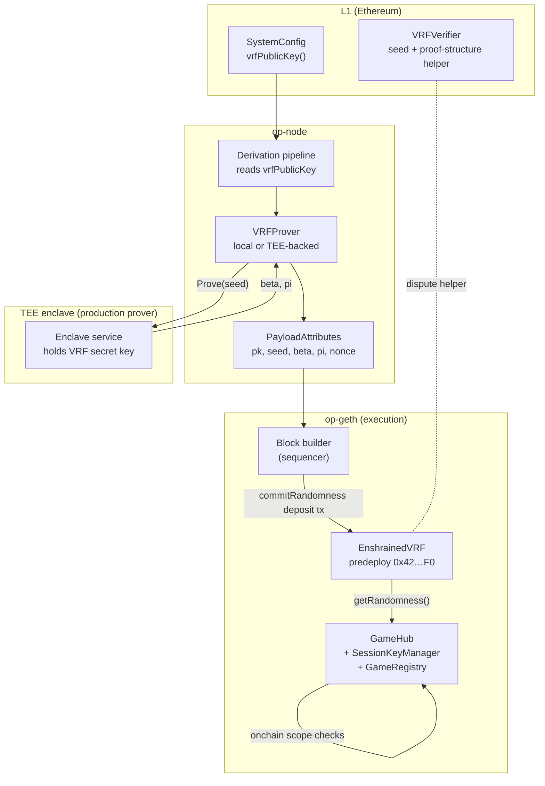

This chain is an OP Stack fork with protocol-level randomness and a session-account contract layer for games. Randomness changes the derivation and payload-building pipeline; session accounts stay inside ordinary EVM state.

## System diagram

## Layers at a glance

<CardGroup cols={3}>
  <Card title="Execution" icon="microchip" href="/architecture/execution">
    `op-geth` hosts the EnshrinedVRF predeploy, executes session-account contracts, and injects VRF system deposits from payload attributes.
  </Card>
  <Card title="Sequencer / TEE" icon="lock" href="/architecture/sequencer">
    `op-node` requests one proof per block from a `VRFProver`; production deployments use a TEE-backed prover.
  </Card>
  <Card title="Fault proof" icon="gavel" href="/architecture/fault-proof">
    Batch data carries VRF proof material so verifier nodes and fault-proof programs can reconstruct the same commit.
  </Card>
</CardGroup>

## Two additions, different boundaries

The two additions have different integration boundaries:

1. **VRF is protocol-wired.** The EVM resolves randomness through the `EnshrainedVRF` predeploy. `op-node` supplies proof material in `PayloadAttributes`, and `op-geth` commits it with a system deposit each block.
2. **Session accounts are ordinary EVM contracts today.** They need no sequencer hook, special transaction type, or privileged sender. The docs reserve fixed `0x4200...` addresses for a later enshrined deployment.
3. **Keep derivation replayable.** VRF seed, beta, proof, and nonce are carried through batches so verifier nodes can rebuild the same system deposit without access to the prover.
4. **Use L1 as the anchor.** `SystemConfig` stores the accepted VRF public key. The L1 `VRFVerifier` helps disputes check seed construction and proof-to-hash consistency, while full ECVRF verification is available through fault-proof re-execution with the `0x0101` precompile.

This keeps the trust boundary small. A user trusts the chain; the chain trusts the configured prover for one thing, protecting the VRF private key. Everything else is either derivation data or pure contract logic.

## Where to go from here

<CardGroup cols={2}>
  <Card title="Execution path" href="/architecture/execution" icon="microchip">
    What `op-node` puts in payload attributes and what `op-geth` writes into the predeploy.
  </Card>
  <Card title="Sequencer & Prover" href="/architecture/sequencer" icon="lock">
    How the VRF secret key is isolated behind the prover interface and anchored on L1.
  </Card>
  <Card title="Fault proof" href="/architecture/fault-proof" icon="gavel">
    Dispute flow: batch evidence, L1 helper checks, and fault-proof re-execution.
  </Card>
  <Card title="Predeploys" href="/concepts/predeploys" icon="box">
    Quick-reference for the current VRF predeploy and target session-account addresses.
  </Card>
</CardGroup>
