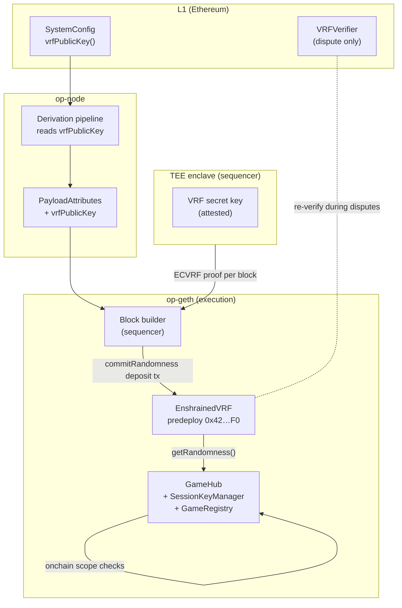

This chain is an OP Stack fork with two protocol-level additions: randomness and session-based accounts. Both show up in the same three places an OP Stack change always touches — the execution client (`op-geth`), the sequencer, and the fault-proof path to L1.

## System diagram

## Layers at a glance

<CardGroup cols={3}>
  <Card title="Execution" icon="microchip" href="/architecture/execution">
    `op-geth` hosts the predeploys that implement VRF, session accounts, and game registration.
  </Card>
  <Card title="Sequencer / TEE" icon="lock" href="/architecture/sequencer">
    The VRF secret key lives inside an attested TEE enclave. The operator cannot extract it.
  </Card>
  <Card title="Fault proof" icon="gavel" href="/architecture/fault-proof">
    L1 holds `VRFVerifier`, which replays an ECVRF proof during a dispute so no one has to trust the sequencer blindly.
  </Card>
</CardGroup>

## Two protocol additions, one pattern

Both additions follow the same playbook:

1. **Put the primitive in a predeploy.** The EVM can resolve it in one `SLOAD`/`CALL`, and frontends hard-code a single address.
2. **Hook the sequencer when necessary.** VRF needs a per-block `commitRandomness` deposit transaction; session accounts need nothing extra from the sequencer, because they're pure EVM state.
3. **Keep L1 as the arbiter.** VRF proofs can be re-verified on L1 during disputes. Session accounts have no trusted sequencer input — their correctness is enforced purely by the predeploy logic.

This keeps the trust boundary small. A user trusts the chain; the chain trusts its attested enclave for one thing (the VRF private key); everything else is pure contract logic.

## Where to go from here

<CardGroup cols={2}>
  <Card title="Execution path" href="/architecture/execution" icon="microchip">
    What the modified `op-geth` does when it builds a block and when it serves a `getRandomness()` call.
  </Card>
  <Card title="Sequencer & TEE" href="/architecture/sequencer" icon="lock">
    How the VRF secret key is generated, attested, and used — and how that's visible on L1.
  </Card>
  <Card title="Fault proof" href="/architecture/fault-proof" icon="gavel">
    Dispute flow: L1 challengers, `VRFVerifier` replay, and what actually gets slashed.
  </Card>
  <Card title="Predeploys" href="/concepts/predeploys" icon="box">
    Quick-reference addresses and upgrade path for the four core predeploys.
  </Card>
</CardGroup>
