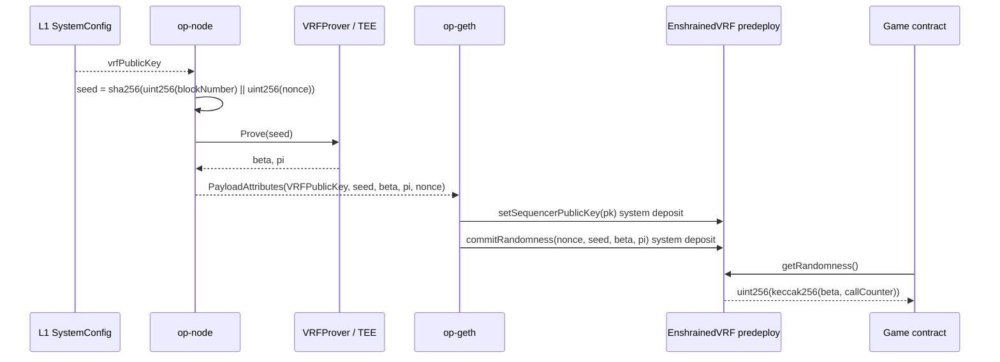

<Info>
  **Predeploy address:** `0x42000000000000000000000000000000000000f0`
</Info>

Enshrined VRF is the chain's native randomness protocol. Games call one fixed predeploy and receive a `uint256` in the same transaction. There is no oracle request, callback, LINK balance, or per-game VRF coordinator.

The protocol has two paths:

- **Sequencing path:** `op-node` obtains one ECVRF proof per L2 block and passes it to `op-geth` through Engine API payload attributes.
- **Execution path:** `op-geth` turns those attributes into system deposit transactions that write the block's randomness commitment into `EnshrainedVRF`.

## Design goals

<CardGroup cols={2}>
  <Card title="Synchronous" icon="bolt">
    `getRandomness()` returns inside the caller's transaction. Games do not wait for an oracle callback or a future block.
  </Card>
  <Card title="Protocol-wide" icon="network-wired">
    Every game consumes the same block commitment from the same predeploy address, which keeps integrations simple and auditable.
  </Card>
  <Card title="Replayable" icon="rotate-left">
    The seed, beta, proof, and nonce are carried through block derivation so verifier nodes can reconstruct the same system deposit without holding the VRF secret key.
  </Card>
  <Card title="Bounded trust" icon="lock">
    Production proving is delegated behind the `VRFProver` interface, typically to a TEE enclave. Local proving exists for development only.
  </Card>
</CardGroup>

## Randomness lifecycle



The public-key deposit is emitted when a 33-byte key is configured in `SystemConfig`. The randomness commit deposit is required after the Enshrined VRF fork is active; if the sequencer cannot provide the proof material, block production halts instead of producing a block without randomness.

## What is committed per block

Each L2 block carries one commitment:

| Field | Source | Purpose |
| ----- | ------ | ------- |
| `nonce` | `op-node` monotonic counter | Domain-separates each VRF proof and maps to the predeploy's commit sequence. |
| `seed` | `sha256(blockNumber, nonce)` | Deterministic input that verifier nodes can recompute. |
| `beta` | `VRFProver.Prove(seed)` | VRF output hash stored by the predeploy and mixed into user-facing randomness. |
| `pi` | `VRFProver.Prove(seed)` | 81-byte ECVRF proof carried for derivation and dispute checks. |
| `vrfPublicKey` | L1 `SystemConfig` | 33-byte compressed secp256k1 key accepted by the chain. |

`commitRandomness(uint256,bytes32,bytes32,bytes)` is callable only by the OP Stack `DEPOSITOR_ACCOUNT` through the synthetic deposit inserted by `op-geth`.

## Per-call derivation

`EnshrainedVRF` stores the current block's `beta` and resets `callCounter` to zero at commit time. Every `getRandomness()` call derives one output and then increments the counter:

```solidity
randomness = uint256(keccak256(abi.encodePacked(currentBeta, callCounter)));
callCounter += 1;
```

This means five calls in the same block produce five deterministic but distinct values, all backed by the same block-level proof.

<Warning>
  Do not call `getRandomness()` from a `view` function. The counter advance is a state change, so a static call reverts.
</Warning>

## Using VRF in a game

<CodeGroup>
```solidity Solidity
import {IEnshrainedVRF} from "interfaces/L2/IEnshrainedVRF.sol";

contract CoinFlip {
    IEnshrainedVRF public constant VRF =
        IEnshrainedVRF(0x42000000000000000000000000000000000000f0);

    function flip() external returns (bool heads) {
        uint256 r = VRF.getRandomness();
        heads = (r % 2 == 0);
    }
}
```
</CodeGroup>

## Sequencer and verifier behavior

<AccordionGroup>
  <Accordion title="Sequencer node">
    A sequencer configures `op-node` with a `VRFProver`. In production this prover delegates to the TEE enclave; in local development it can hold a development key in memory. `op-node` retries transient prover failures, then fails block attribute construction if proof generation still cannot complete.
  </Accordion>
  <Accordion title="Execution client">
    `op-geth` does not know the VRF secret key. It receives proof material in `PayloadAttributes`, validates field lengths, and prepends deposit transactions that call `setSequencerPublicKey` and `commitRandomness` on the predeploy.
  </Accordion>
  <Accordion title="Verifier node">
    A verifier does not need a prover. The batch data carries the committed seed, beta, pi, and nonce, allowing the derivation pipeline to reconstruct the same VRF deposit transaction deterministically.
  </Accordion>
</AccordionGroup>

## Why not an oracle VRF?

<Accordion title="No request/response latency">
  Oracle VRFs require one transaction to request randomness and another delivery path later. Enshrined VRF resolves during the game's transaction.
</Accordion>

<Accordion title="No per-call oracle fee">
  Games pay normal execution gas for a predeploy call. The block-level proof is part of block production, not a per-game oracle request.
</Accordion>

<Accordion title="No external liveness dependency">
  If an external oracle stalls, game randomness stalls. Here, randomness liveness is the sequencer's liveness problem, which is the same operational domain as the chain itself.
</Accordion>

## Trust boundary

The protocol does not claim that the L2 contract alone makes future outputs unknowable. Unpredictability depends on keeping the VRF secret key out of the sequencer operator's reach.

1. **Production mode:** the key lives behind a `VRFProver`, intended to be a TEE enclave with remote attestation.
2. **L1 anchoring:** governance configures the accepted 33-byte `vrfPublicKey` in `SystemConfig`.
3. **Derivation evidence:** seed, beta, pi, and nonce are carried through batches so challengers can reproduce the transition.
4. **Fault-proof support:** the L1 helper checks seed construction and proof-to-hash structure, while full ECVRF verification is available to the fault-proof VM through the `0x0101` precompile path.

## Related

<CardGroup cols={2}>
  <Card title="Execution path" href="/architecture/execution" icon="microchip">
    How `op-node` and `op-geth` turn proof material into predeploy state.
  </Card>
  <Card title="Build a VRF game" href="/guides/build-vrf-game" icon="hammer">
    A minimal game contract that consumes randomness safely.
  </Card>
</CardGroup>
