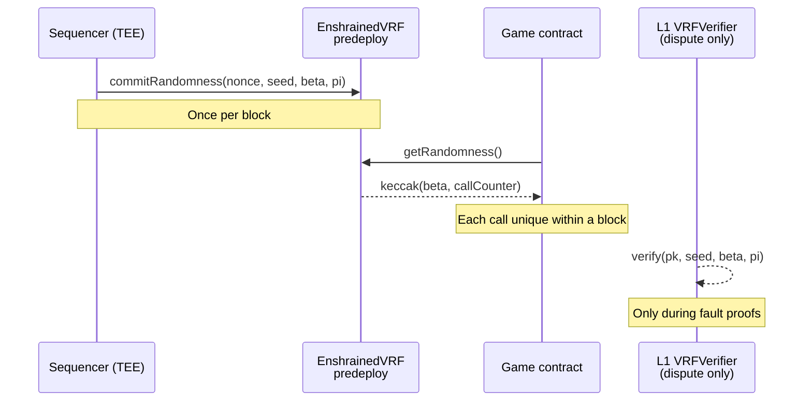

<Info>
  **Predeploy address:** `0x4200000000000000000000000000000000000000F0`
</Info>

Enshrined VRF is the chain's randomness primitive. Every game calls the same predeploy, no external oracle, and the sequencer commits a fresh ECVRF proof once per block.

## Design goals

<CardGroup cols={2}>
  <Card title="Unbiased" icon="scale-balanced">
    Nobody — not even the sequencer — can tilt the output toward themselves, because the secret key producing the VRF lives inside a TEE enclave.
  </Card>
  <Card title="Available" icon="circle-check">
    Every block contains a VRF commitment. A game calling `getRandomness()` always receives a value in the same transaction — no pending callbacks.
  </Card>
  <Card title="Verifiable" icon="magnifying-glass">
    Proofs are published on-chain. Anyone can re-verify them with the `VRFVerifier` L1 contract during a fault-proof dispute.
  </Card>
  <Card title="Unpredictable" icon="lock">
    Values stay secret until the block is sealed. Front-running by the sequencer is prevented by enclave attestation and commit-reveal.
  </Card>
</CardGroup>

## Lifecycle of a VRF value



## Using VRF in a game

<CodeGroup>
```solidity Solidity
import {IEnshrainedVRF} from "interfaces/L2/IEnshrainedVRF.sol";

contract CoinFlip {
    IEnshrainedVRF public constant VRF =
        IEnshrainedVRF(0x4200000000000000000000000000000000000000F0);

    function flip() external returns (bool heads) {
        uint256 r = VRF.getRandomness();
        heads = (r % 2 == 0);
    }
}
```
</CodeGroup>

<Warning>
  Do not call `getRandomness()` in a view function. The per-call counter advances as a side effect; a view call reverts.
</Warning>

## Per-block commit, per-call uniqueness

`EnshrainedVRF` stores one `(seed, beta, pi)` triple per block. `getRandomness()` mixes `beta` with an internal call counter to give every call within the block a distinct output:

```
randomness_i = keccak256(abi.encode(beta, callCounter))
callCounter += 1
```

This means a game calling VRF five times in one transaction gets five distinct uint256s, all derivable from one proof.

## Why not ChainLink VRF?

<Accordion title="Request/response latency">
  Oracle VRFs require one transaction to request randomness and a second, often later block, to deliver it. Real-time games can't wait.
</Accordion>

<Accordion title="Per-call fees">
  Each request costs LINK (or equivalent) plus gas. Enshrined VRF is part of block production and costs only the base `SLOAD` of the predeploy call.
</Accordion>

<Accordion title="External liveness dependency">
  An oracle outage halts game randomness. When VRF is enshrined, the chain and its randomness live or die together.
</Accordion>

## What the sequencer can't do

The sequencer holds the VRF secret key, which sounds like a centralization red flag. The chain mitigates this by:

1. **TEE isolation** — the key exists only inside an attested enclave. The operator cannot extract it.
2. **Key attestation** — the enclave publishes its attestation; the L1 configures which `vrfPublicKey` is accepted.
3. **Proofs on L1** — during a fault proof, `VRFVerifier` re-verifies the proof against the attested public key.

This reduces the "must trust the sequencer" surface to "must trust that the enclave was attested correctly" — a much smaller trust boundary.

## Related

<CardGroup cols={2}>
  <Card title="VRF contract reference" href="/contracts/enshrined-vrf" icon="file-code">
    Full interface, errors, and events.
  </Card>
  <Card title="Build a VRF game" href="/guides/build-vrf-game" icon="hammer">
    Walk-through for a self-registering game that uses VRF safely.
  </Card>
</CardGroup>
