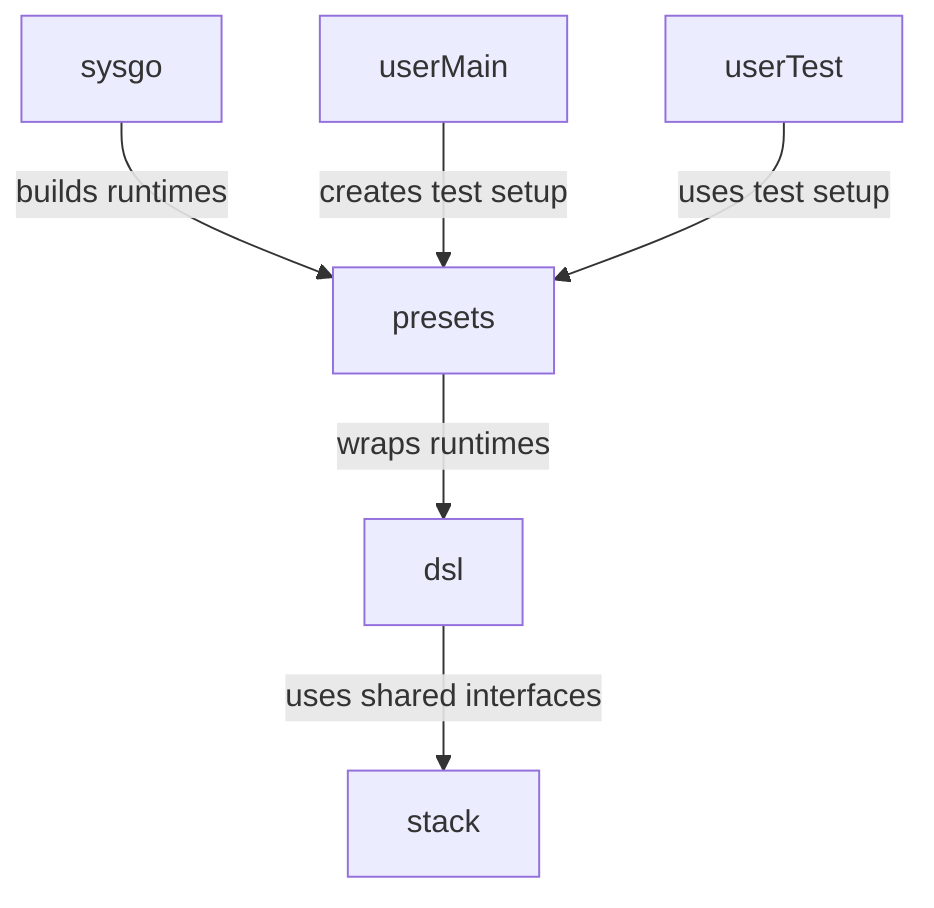

# op-devstack

Devstack provides typed test presets and DSL helpers for integration and acceptance testing.

## Overview

### Packages

- `devtest`: test handles and lifecycle helpers.
- `stack`: shared interfaces and common types used across DSL and runtime code.
- `sysgo`: process-backed and in-process runtime constructors for local test systems.
- `presets`: typed constructors that build fresh systems per test and expose convenient frontends.
- `dsl`: test interaction helpers built on top of preset frontends.

### Patterns

There are some common patterns in this package:

- `stack.X` (interface): presents a component
- `stack.X` (interface): stable protocol for a component category.
- `sysgo`: builds explicit runtime graphs for local test systems.
- `presets`: translate runtime references into typed preset outputs and DSL helpers.
- Preset constructors build explicit component graphs directly and return those references to tests.

### Components

Available components:

- `System`: a collection of chains and other components
- `L1Network`: a L1 chain configuration and registered L1 components
  - `L1ELNode`: L1 execution-layer node, like geth or reth.
  - `L1CLNode`: L1 consensus-layer node. A full beacon node or a mock consensus replacement for testing.
- `L2Network`: a L2 chain configuration and registered L2 components
  - `L2ELNode`: L2 execution-engine, like op-geth or op-reth
  - `L2CLNode`: op-node service, or equivalent
  - `L2Batcher`: op-batcher, or equivalent
  - `L2Proposer`: op-proposer, or equivalent
  - `L2Challenger`: op-challenger, or equivalent
  - `L2MetricsDashboard`: runs prometheus and grafana instances if any component registers metrics endpoints
- `Supervisor`: op-supervisor service, or equivalent
- `Faucet`: util to fund eth to test accounts

### DSL-only components

Some components are DSL-only: these are ephemeral,
live only for the duration of a test-case, and do not share state with other tests.

Available components:
- `Key`: a chain-agnostic private key to sign ethereum things with.
- `HDWallet`: a source to create new `Key`s from.
- `EOA`: an Externally-Owned-Account (EOA) is a private-key backed ethereum account, specific to a single chain.
  This is a `Key` coupled to an `ELNode` (L1 or L2).
- `Funder`: a wallet combined with a faucet and EL node, to create pre-funded `EOA`s

#### `presets`, `Option`, `TestSetup`

The `presets` package provides options, generally named `With...`.

Each `Option` may apply changes to one or more of the setup stages.
E.g. some options may customize contract deployments, others may customize nodes,
and others may do post-validation of test setups.

A `TestSetup` is a function that prepares the frontend specific to a test,
and returns a typed output that the test then may use.

## Design choices

- Interfaces FIRST. Composes much better.
- Incremental system composition. In the DSL package, maximize reusability by implementing DSL methods on the "lowest common denominator", e.g. prefer EL over Network. In tests, maximize readability by using the highest level of abstraction possible.
- Type-safety is important. Internals may be more verbose where needed.
- Everything is a resource and has a typed ID
- Embedding and composition de-dup a lot of code.
- Avoid generics in method signatures, these make composition of the general base types through interfaces much harder.
- Each component has access to commons such as logging and a test handle to assert on.
  - The test-handle is very minimal, so that tooling can implement it, and is only made accessible for internal sanity-check assertions.
- Option pattern for each type, taking the interface, so that the system can be composed by external packages, eg:
  - Kurtosis
  - System like op-e2e
  - Action-test
- Implementations should take `client.RPC` (or equivalent), not raw endpoints. Dialing is best done by the system composer, which can customize retries, in-process RPC pipes, lazy-dialing, etc. as needed.
- The system composer is responsible for tracking raw RPC URLs. These are not portable, and would expose too much low-level detail in the System interface.
- The system composer is responsible for the lifecycle of each component; in-process systems couple to the test lifecycle and shut down via `t.Cleanup`.
- Test gates do not have direct access to the `Orchestrator`; tests interact through typed preset outputs.
- Tests are isolated by default: each test constructs its own fresh system target.
- There are no "chains": the word "chain" is reserved for the protocol typing of the onchain / state-transition related logic. Instead, there are "networks", which include the offchain resources and attached services of a chain.
- Do not abbreviate "client" to "cl", to avoid confusion with "consensus-layer".

## Environment Variables

### The following environment variables can be used to configure devstack:

- `DEVSTACK_KEYS_SALT`: Seeds the keys generated with `NewHDWallet`. This is useful for "isolating" test runs, and might be needed to reproduce CI and/or acceptance test runs. It can be any string, including the empty one to use the "usual" devkeys.
- `DEVNET_EXPECT_PRECONDITIONS_MET`: This can be set of force test failures when their pre-conditions are not met, which would otherwise result in them being skipped. This is helpful in particular for runs that do intend to run specific tests (as opposed to whatever is available). `op-acceptor` does set that variable, for example.

### Rust stack env vars:
- `DEVSTACK_L2CL_KIND=kona-node` to select kona-node as default L2 CL node
- `DEVSTACK_L2EL_KIND=op-reth` to select op-reth as default L2 EL node
- `KONA_NODE_EXEC_PATH=/home/USERHERE/projects/kona/target/debug/kona-node` to select the kona-node executable to run
- `OP_RETH_EXEC_PATH=/home/USERHERE/projects/reth/target/release/op-reth` to select the op-reth executable to run

### Go stack env vars:
- `DEVSTACK_L1EL_KIND=geth` to select geth as default L1 EL node
- `SYSGO_GETH_EXEC_PATH=/path/to/geth` to select the geth executable to run

### Metrics env vars:
- `SYSGO_METRICS_ENABLED` set to `true` to enable metrics to be exposed via prometheus and grafana for all running components that expose metrics (default: `false`)
- `SYSGO_DOCKER_EXEC_PATH` path to docker executable (defaults to `docker` assuming it is in your `PATH`)
- `SYSGO_GRAFANA_PROVISIONING_DIR` to provide a local grafana provisioning dir to use (otherwise a temp dir will be created and removed at the end of tests)
- `SYSGO_GRAFANA_DATA_DIR` to provide a local grafana data dir to use (otherwise a temp dir will be created and removed at the end of tests)
- `SYSGO_GRAFANA_DOCKER_IMAGE_TAG` indicates which grafana docker image tag should be used (default is `12.2`).
- `SYSGO_PROMETHEUS_DOCKER_IMAGE_TAG` indicates which prometheus docker image tag should be used (default is `v3.7.2`).

### Other useful env vars:
- `DISABLE_OP_E2E_LEGACY=true` to disable the op-e2e package from loading build-artifacts that are not used by devstack.

## Metrics
If [metrics are enabled](#metrics-env-vars) and any component is configured to expose metrics, prometheus and grafana instances will be created via docker to serve them to the user.

If metrics are enabled, the grafana instance will be served at `http://localhost:3000`. If that port is in use, the dev stack may fail to deploy.

### Requirements
The [Docker](https://docs.docker.com) binary must be installed and either be available in your `PATH` as `docker` or configured via `SYSGO_DOCKER_EXEC_PATH` See [Environment Variables](#metrics-env-vars).

### Configuring dashboards
When configuring dashboards, note that there is a single prometheus datasource available at `http://host.docker.internal:9999`.

> [!TIP]
> It is recommended to set a `SYSGO_GRAFANA_PROVISIONING_DIR` and `SYSGO_GRAFANA_DATA_DIR`. This allows any configured datasources, dashboards, and visualizations to persist across restarts. If these variables are not set, temporary directories will be used and any configuration will be lost on restart.
