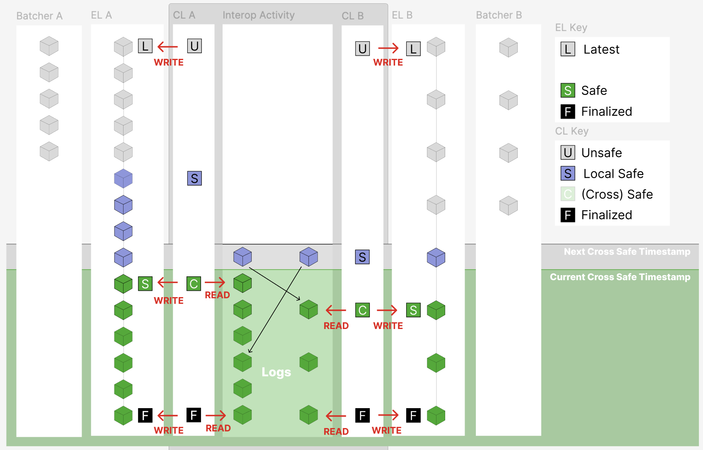

# Safety Labels

## Architecture Decision: CL-Centric Control

[Context: Issue #18976](https://github.com/ethereum-optimism/optimism/issues/18976)

### The Problem

With the supernode model, there are multiple components, each with a different degree of understanding over various safety labels:

- **EL (Execution Layer)**: Minimal diff to L1 execution clients, where safety and finality follow the chain head after enough time has passed.
- **CL (Consensus Layer)**: Responsible for derivation for a single chain, validating the data availability of block inputs posted to L1 by the batcher.
- **Super (Supernode)**: Coordinates multiple CLs for multiple chains, and is able to perform higher-order validation of a set of locally derived blocks from those different chains.

Customers expect the EL's `Safe` label to guarantee data won't revert (barring L1 reverts), before the supernode introduced the idea of higher-order validation, safe was synonymous with "derived". So a decision was made to introduce a new label for derived-but-not-yet-fully-verified, but to keep the EL ignorant of that label.

### The Solution

The consensus layer (CL) maintains the full, rich set of safety pointers `[Unsafe, Safe, CrossSafe, Finalized]` and remains the **sole controller of the engine**. The supernode exerts influence through an "authority" pattern that virtual nodes defer to, without requiring them to understand interop mechanics.

> TODO: We plan to rename `CrossSafe` to `VerifiedSafe` in https://github.com/ethereum-optimism/optimism/issues/19187 (this is a generalised term which is not tied to interop per se).

This approach avoids having multiple stateful controllers which could get out of sync.

### Key Takeaway

Rather than augmenting the EL with new labels like "local safe" or "unverified safe", we leverage the CL's existing interop-aware structures. The CL acts as the single source of truth for all safety levels, while the supernode influences safety advancement through an authority interface.

These concepts are summarized in the following diagram:

